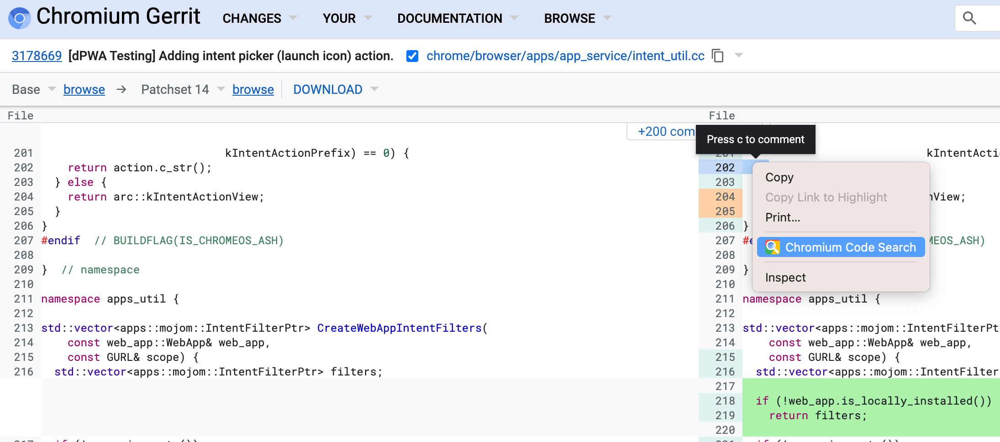
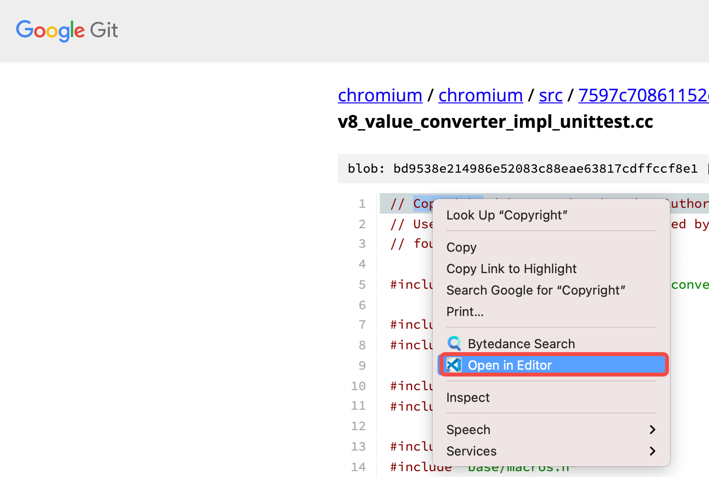
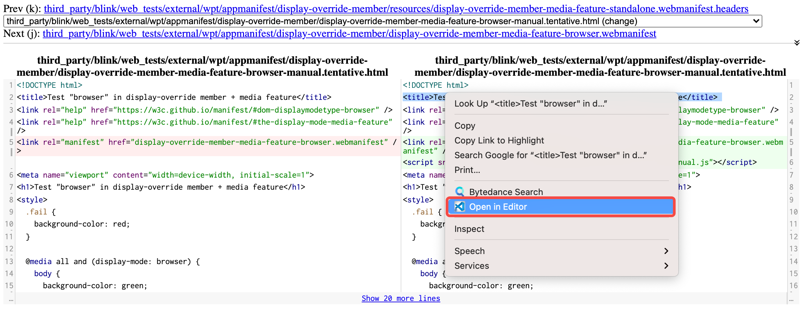

# Chromium Code Search (CCS)

`CCS` gives you a context menu for linking code search path to 
[source.chromium.org](https://source.chromium.org) from
[Chromium Gerrit](https://chromium-review.googlesource.com),
[Google Git](https://chromium.googlesource.com) and
[webdiff-for-coi](https://pypi.org/project/webdiff-for-coi).

## Installation

Install this Chrome Extension from Web Store.

## Usage

- For [Chromium Gerrit](https://chromium-review.googlesource.com): \
right-click on code block and select `Chromium Code Search`, 
it will open the file in [source.chromium.org](https://source.chromium.org) at the selected line.

    

- For [Google Git](https://chromium.googlesource.com):

    - click on the line number (optional).
    - choose and right-click on any code block.
    - select `Chromium Code Search`.

    It will open the file in [source.chromium.org](https://source.chromium.org) (at the selected line).

    

- For [webdiff-for-coi](https://pypi.org/project/webdiff-for-coi): \
right-click on code block and select `Chromium Code Search`,
it will open the file in [source.chromium.org](https://source.chromium.org).

    
    
**Enjoy!**
